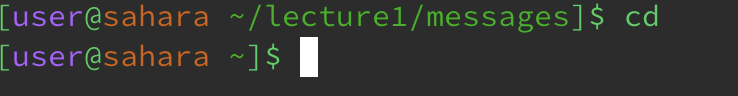
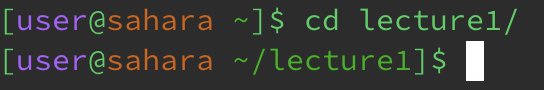
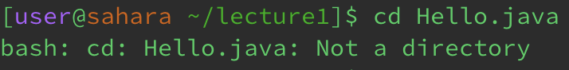
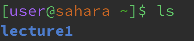
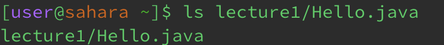
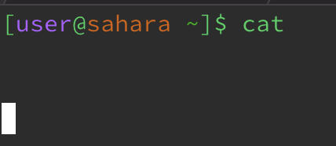
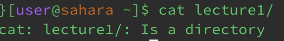
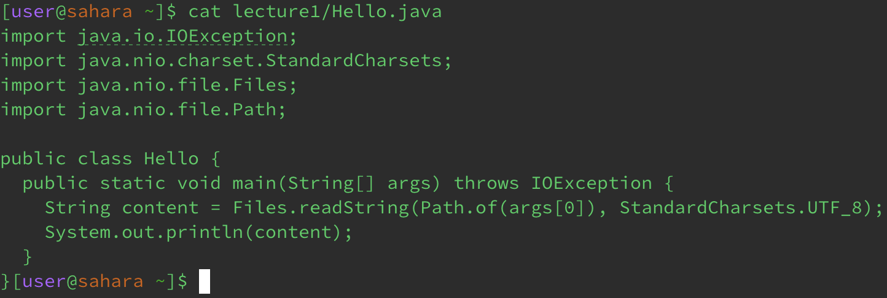

# Lab Report 1
## cd

  
Working directory: /home/lecture1/messages
Explanation: We got this output because when you use the cd command with no arguments, you are changing the directory to the home directory.
This is because the starting directory of this terminal is the /home directory.
Error: No

Working directory: /home
Explanation: We got this output because when you use the cd command with a path to a directory as an argument, it will switch to that directory.
Error: No

  
Working directory: /home/lecture1/
Explanation: We got this output because when you use the cd command with a path to a file as an argument, it will not recognize that as a directory.
Error: There is an error because the argument for the cd commands can only take directorys and not specific files.
## ls

Working directory: /home
Explanation: We got this output because when you use the ls command with no arguments, it will just show the contents in the directory you are currently in.
Error: No

Working directory: /home
Explanation: We got this output because when you use the ls command with a path to a directory as an argument, 
it will display the contents of the directory that you specified.
Error: No

Working directory: /home
Explanation: We got this output because when you use the ls command with a path to a file as an argument, it will show the contents of that directory which is nothing because it 
is a file and not a directory.
Error: No
## cat

Working directory: /home
Explanation: We got this output because when you run the cat command with no arguments, it won't display anything because there are no contents for it to read.
Error: There is an error because no argument provided for this command will not give it anything to read.

Working directory: /home
Explanation: We got this output because when you use the cat command with a path to a directory as an argument, it will not recognize this directory as a file.
Error: There is an error because when the argument provided is not a file.

Working directory: /home
Explanation: We got this output because when you use the cat command with a path to a file as an argument, it will display the contents presented in the file.
Error: No
