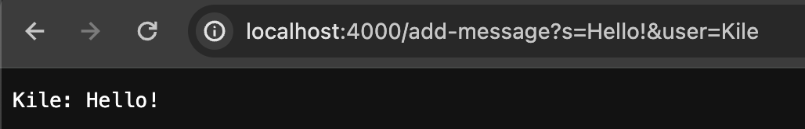
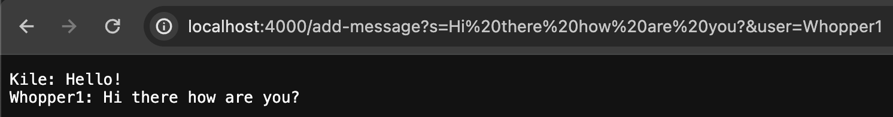
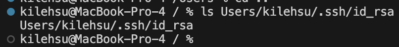
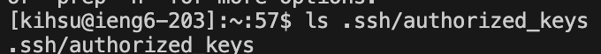
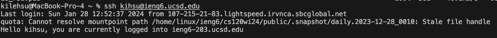

# Lab Report 2

## ChatServer Code (Part 1)

~~~~
import java.io.IOException;
import java.net.URI;

class Handler implements URLHandler {
    // The one bit of state on the server: a number that will be manipulated by
    // various requests.
    String fullMsg = "";

    public String handleRequest(URI url) {
        if (url.getPath().equals("/")) {
            return "Welcome to our ChatServer!";
        } 
        else if (url.getPath().contains("/add-message")) {
            String[] parameters = url.getQuery().split("=");
            if (parameters[0].equals("s")) {
                String message = parameters[1].substring(0, parameters[1].indexOf("&"));
                fullMsg += (String.format("%s: %s", parameters[2], message) + "\n");
                return fullMsg;
            }

        }
        return "404 Not Found!";
    }
}

class ChatServer {
    public static void main(String[] args) throws IOException {
        if(args.length == 0){
            System.out.println("Missing port number! Try any number between 1024 to 49151");
            return;
        }

        int port = Integer.parseInt(args[0]);

        Server.start(port, new Handler());
    }
}
~~~~

## Screenshots

### Methods Called: 

~~~
handleRequest(URI url)
~~~

### Arguments and Relevant Fields:

The url argument is relevant to this method call because it is what specifies which url to read from in the method.
The values of the fullMsg change after handle request is called and the values of the parameter array are changed depending
on the argument of the message.

~~~
fullMsg = "Kile: Hello!"
url = localhost:4000/add-message?s=Hello!&user=Kile
parameters[0] = "s"
parameters[1] = "Hello!&user"
parameters[2] = "Kile"
message = "Hello!"
~~~

### Methods Called: 

~~~
handleRequest(URI url)
~~~

### Arguments and Relevant Fields:

The url argument is relevant to this method call because it is what specifies which url to read from in the method.
The values of the fullMsg change after handle request is called to include both the messages from each time the handleRequest is called
and the values of the parameter array are changed depending on the argument of the message.

~~~
fullMsg = "Kile: Hello!
           Whopper1: Hi there how are you?"
url = localhost:4000/add-message?s=Hi%20there%20how%20are%20you?&user=Whopper1
parameters[0] = "s"
parameters[1] = "Hi%20there%20how%20are%20you?&user"
parameters[2] = "Whopper1"
message = "Hi there how are you?"
~~~

## SSH (Part 2)

### Private Key Absolute Path

### Public Key Absolute Path

### Terminal Interaction

## Part 3

One thing that I learned from lab in week 2 and 3 was how to add a public key in order to ssh
into a remote server without being prompted for a password. I was able to use the mkdir command in the
remote server in order to use the scp command to copy my public key into the remote server's directory for my
authorized key.

