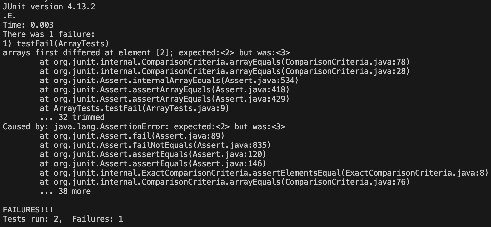

# Lab Report 3

## Part 1 - Bugs

### Failure Inducing Input
~~~~
@Test
public void testFail() {
  int[] input1 = {1, 2, 3, 4};
  ArrayExamples.reverseInPlace(input1);
  assertArrayEquals(new int[]{4, 3, 2, 1}, input1);
}
~~~~
### No Failure Input
~~~~
@Test
public void testPass() {
  int[] input1 = { 3 };
  ArrayExamples.reverseInPlace(input1);
  assertArrayEquals(new int[]{ 3 }, input1);
}
~~~~
### Symptom

### Before
~~~~
static void reverseInPlace(int[] arr) {
  for(int i = 0; i < arr.length; i += 1) {
      arr[i] = arr[arr.length - i - 1];
  }
}
~~~~
### After
~~~~
static void reverseInPlace(int[] arr) {
  for(int i = 0; i < arr.length / 2; i += 1) {
      int temp = arr[i];
      arr[i] = arr[arr.length - i - 1];
      arr[arr.length - i - 1] = temp;
  }
}
~~~~

The fix for the reverseInPlace method changes the for loop to only interate
over the first half of the array and uses a temporary variable to store the
previous value of arr[i] before it is updated by arr[arr.length - i - 1].

