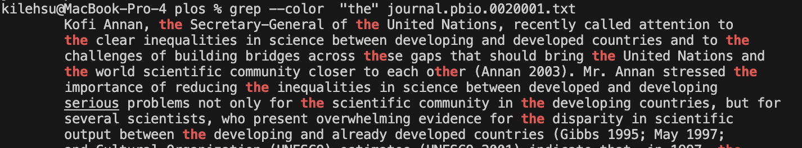

# Lab Report 3

## Part 1 - Bugs

### Failure Inducing Input
~~~~
@Test
public void testFail() {
  int[] input1 = {1, 2, 3, 4};
  ArrayExamples.reverseInPlace(input1);
  assertArrayEquals(new int[]{4, 3, 2, 1}, input1);
}
~~~~
### No Failure Input
~~~~
@Test
public void testPass() {
  int[] input1 = { 3 };
  ArrayExamples.reverseInPlace(input1);
  assertArrayEquals(new int[]{ 3 }, input1);
}
~~~~
### Symptom

### Before
~~~~
static void reverseInPlace(int[] arr) {
  for(int i = 0; i < arr.length; i += 1) {
      arr[i] = arr[arr.length - i - 1];
  }
}
~~~~
### After
~~~~
static void reverseInPlace(int[] arr) {
  for(int i = 0; i < arr.length / 2; i += 1) {
      int temp = arr[i];
      arr[i] = arr[arr.length - i - 1];
      arr[arr.length - i - 1] = temp;
  }
}
~~~~

The fix for the reverseInPlace method changes the for loop to only interate
over the first half of the array and uses a temporary variable to store the
previous value of arr[i] before it is updated by arr[arr.length - i - 1].

## Part 2 - Researching Commands (grep) [Source](https://www.redswitches.com/blog/grep-command-in-linux/)

### --color
~~~~
grep --color "the" journal.pbio.0020001.txt
~~~~
**Output**

This command highlights the the words in the text in color that match the specific line
to search for. In this example, it highlights the word "the" which makes it easier to find the
actual occurences of the word.

~~~~
grep --color "kile" journal.pbio.0020001.txt
~~~~
**Output**

This command highlights the words in the text in color that match the phrase "kile". Since there's
no color in the text at all it means that it didn't find that term.

### -v
~~~~
grep -v "the" journal.pbio.0020001.txt
~~~~
**Output**

This command shows the text without the specified word in the command. Since the phrase "the"
appears in a lot of lines of the text it removes a lot of chunks of the text. This is useful
to remove unnecessary parts of a text that you don't want to read.

~~~~
grep -v "kile" journal.pbio.0020001.txt
~~~~
**Output**

This command shows that the phrase "kile" is not found in the text at all so it displays the whole text.
This can be useful when trying to make sure the specific term isn't in the text at all.

### -c
~~~~
grep -c "the" journal.pbio.0020001.txt
~~~~

**Output**

This command shows the count of the times that the phrase "the" appears in the text. This is useful to see the
count of the phrase without putting the output of the grep command into a file and counting the lines.

~~~~
grep -c "kile" journal.pbio.0020001.txt
~~~~

**Output**

This command shows the count of the times that the phrase "kile" appears in the text. This is useful to see if
a phrase is even in the text at all.

### -w
~~~~
grep -w --color "developing" journal.pbio.0020001.txt
~~~~
**Ouput**

This command highlights where the specific word "developing" appears in the text as its own word and
not included in a word like "undeveloping". This is useful to see the actual occurence of the word by itself.

~~~~
grep -w --color "develop" journal.pbio.0020001.txt
~~~~
**Ouput**

This command outputs nothing from the text because the specific word "develop" appears nowhere within the text
by itself without being included in "developing".

