# Lab Report 4 - Vim (Week 7)

## Step 4

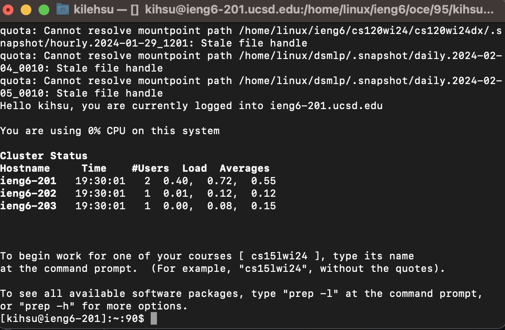

### Keys Pressed
~~~~
ssh kihsu@ieng6.ucsd.edu<enter>
~~~~

I ran the `ssh` command to connect to the ieng6 server.

## Step 5

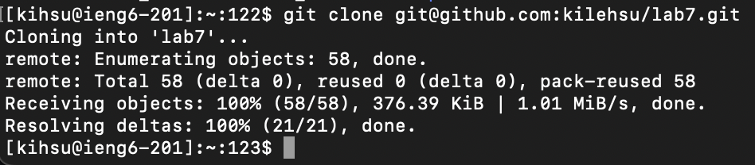

### Keys Pressed
~~~~
git clone <Command-V><enter>
~~~~

The ssh url of my repository can be found on the github page so I just copied it
and pasted it into the terminal to clone my repository.

## Step 6

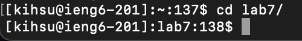

### Keys Pressed
~~~~
cd l<tab><enter>
~~~~

I first navigated to the directory of lab7 by using `<tab>` as lab7 is the only directory to start with "l".

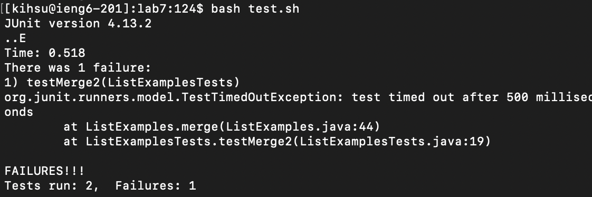

### Keys Pressed
~~~~
bash t<tab><enter>
~~~~

I ran the bash script and used `<tab>` to find the "test.sh" file to run it faster.

## Step 7

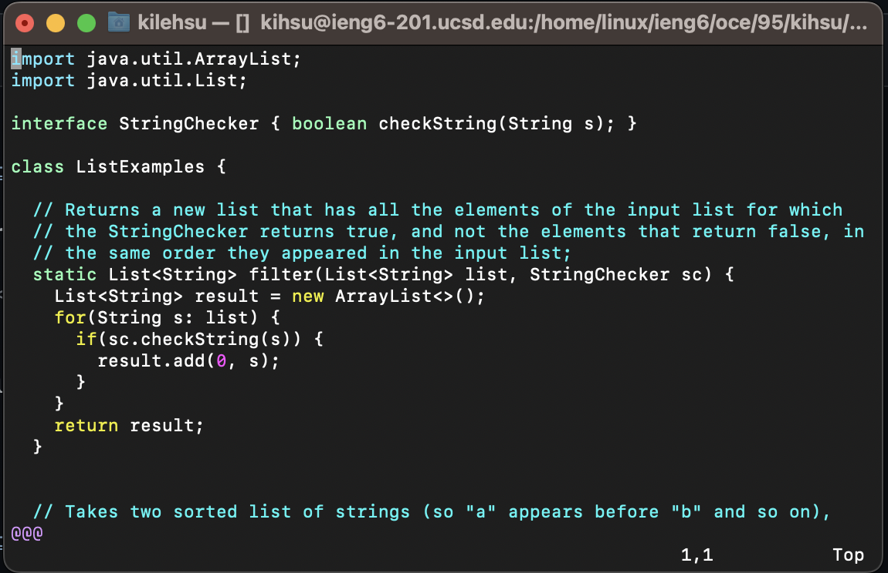

### Keys Pressed
~~~~
vim L<tab>.j<tab><enter>
~~~~

I used the `vim` command and then used tab to get the "ListExamples" autocomplete and then I typed a .j and hit `<tab>` to get the java file.

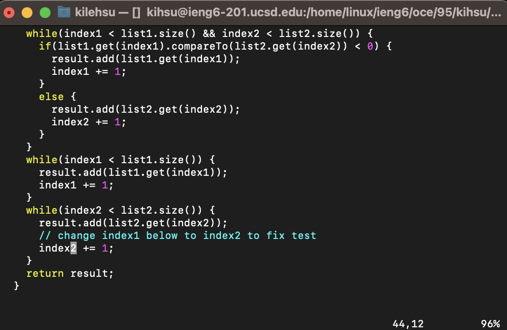

### Keys Pressed
~~~~
44G<right><right><right><right><right>r2
~~~~

I used the `44G` shortcut to go to line 44 of the file as I have done these steps before and memorized the line number. I hit the right button
until I reach the "1" and use `r` to replace 1 to 2 instead of inserting and having to click more keys.

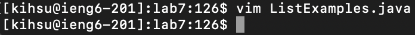

### Keys Pressed

~~~~
:wq!<enter>
~~~~

I used these keys to save the file and exit vim.

## Step 8

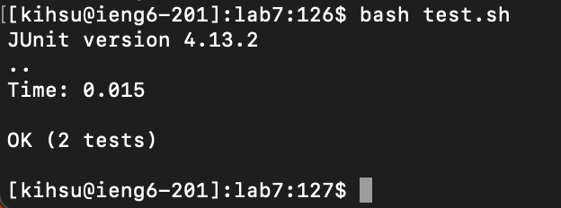

### Keys Pressed

~~~~
<up><up><enter>
~~~~

The `bash test.sh` command was 2 up in the search history so I used the up arrow to access it.

## Step 9

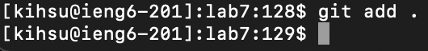

### Keys Pressed

~~~~
git add .<enter>
~~~~

The `git add .` command stages all changes in the current directory due to "."

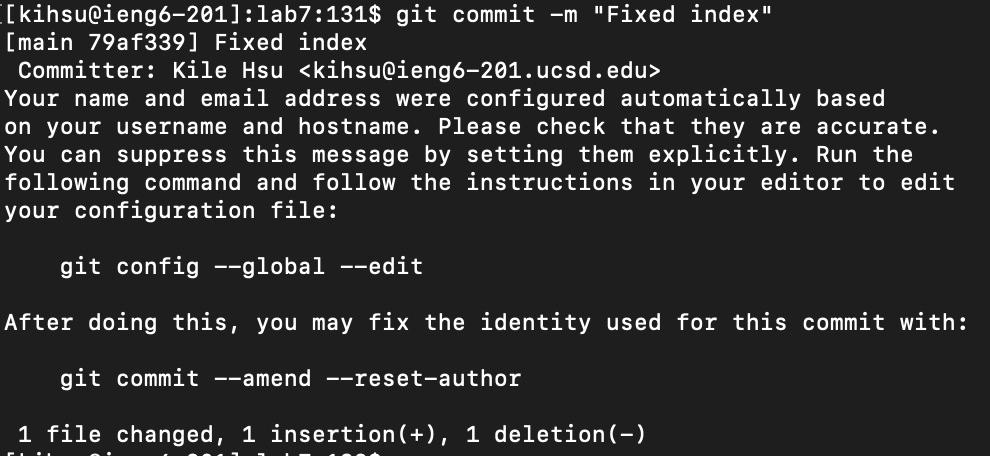

### Keys Pressed

~~~~
git commit -m "Fixed index"<enter>
~~~~

The `git commit` command captures the currently staged changes and creates a new commit with comments "Fixed index" in my local repository

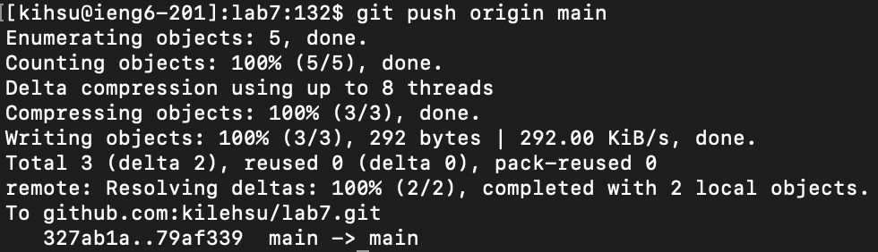

### Keys Pressed

~~~~
git push origin main<enter>
~~~~

The `git push` command updates the remote repository with the commits from my local repository's main branch.
