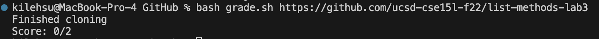
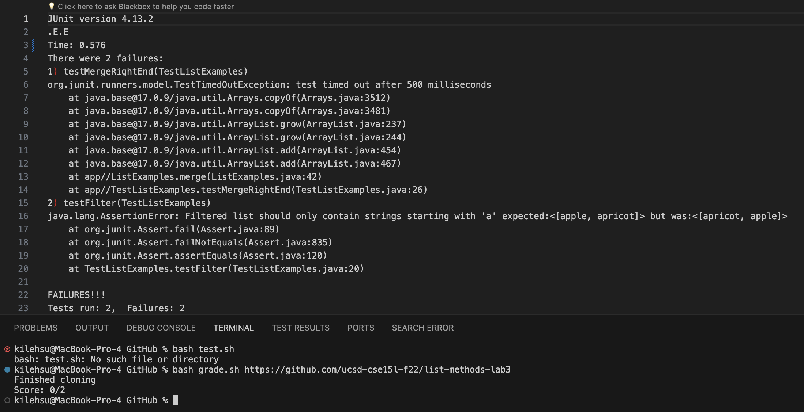

# Lab Report 5 - Putting it All Together (Week 9)

## Part 1 – Debugging Scenario

### Student Post
Hello, when I am running my own submission through the autograder I am getting a 0/2 and when
I look at the junit output it just says that it timed out. What does this mean as I thought I fixed my code. I
have a file called `grade.sh`, `TestListExamples.java` and `ListExamples.java` in the same directory. Here is my output.

Here is my code for `ListExamples.java`:
~~~~
import java.util.ArrayList;
import java.util.List;

interface StringChecker { boolean checkString(String s); }

class ListExamples {

  // Returns a new list that has all the elements of the input list for which
  // the StringChecker returns true, and not the elements that return false, in
  // the same order they appeared in the input list;
  static List<String> filter(List<String> list, StringChecker sc) {
    List<String> result = new ArrayList<>();
    for(String s: list) {
      if(sc.checkString(s)) {
        result.add(0, s);
      }
    }
    return result;
  }

  // Takes two sorted list of strings (so "a" appears before "b" and so on),
  // and return a new list that has all the strings in both list in sorted order.
  static List<String> merge(List<String> list1, List<String> list2) {
    List<String> result = new ArrayList<>();
    int index1 = 0, index2 = 0;
    while(index1 < list1.size() && index2 < list2.size()) {
      if(list1.get(index1).compareTo(list2.get(index2)) < 0) {
        result.add(list1.get(index1));
        index1 += 1;
      }
      else {
        result.add(list2.get(index2));
        index2 += 1;
      }
    }
    while(index1 < list1.size()) {
      result.add(list1.get(index1));
      index1 += 1;
    }
    while(index2 < list2.size()) {
      result.add(list2.get(index2));
      index1 += 1;
    }
    return result;
  }

}
~~~~
Here is my code for `ListExamplesTest.java`:
~~~~
import static org.junit.Assert.*;
import org.junit.*;
import java.util.Arrays;
import java.util.List;

public class TestListExamples {
    @Test
    public void testFilter() {
        List<String> inputList = Arrays.asList("apple", "banana", "apricot", "cherry");
        StringChecker sc = new StringChecker() {
            @Override
            public boolean checkString(String s) {
                return s.startsWith("a"); // Filter strings that start with "a"
            }
        };
        
        List<String> expected = Arrays.asList("apple", "apricot"); // Expected result
        List<String> result = ListExamples.filter(inputList, sc);
        
        assertEquals("Filtered list should only contain strings starting with 'a'", expected, result);
    }
    @Test(timeout = 500)
    public void testMergeRightEnd() {
      List<String> left = Arrays.asList("a", "b", "c");
      List<String> right = Arrays.asList("a", "d");
      List<String> merged = ListExamples.merge(left, right);
      List<String> expected = Arrays.asList("a", "a", "b", "c", "d");
      assertEquals(expected, merged);
    }
}
~~~~
Here is my code for `grade.sh`:
~~~~
rm -rf student
git clone $1 student 2> ta-output.txt
echo "Finished cloning"
rm -rf grading
mkdir grading

if [ ! -f student/ListExamples.java ]; then
    echo "ListExamples.java not found in the submission."
    exit 1
fi

cp student/ListExamples.java grading/
cp TestListExamples.java grading/
cd grading

CPATH='.:../lib/hamcrest-core-1.3.jar:../lib/junit-4.13.2.jar'
javac -cp $CPATH *.java 2> ../ta-output.txt
if [ $? -ne 0 ]; then
    # Compilation failed, write a message to ta-output.txt
    echo "Compilation failed due to errors in the code."
    # Optionally, you can exit the script if you don't want to continue further
    exit 1
fi
java -cp $CPATH org.junit.runner.JUnitCore TestListExamples > junit-output.txt
TEST_OUTPUT=$(<junit-output.txt)
PASSED_TESTS=$(echo "$TEST_OUTPUT" | grep -o 'Tests run: [0-9]*,  Failures: [0-9]*' | awk '{print $3-$5}')
TOTAL_TESTS=$(echo "$TEST_OUTPUT" | grep -o 'Tests run: [0-9]*' | awk '{print $3}')

# Calculate the score
if echo "$TEST_OUTPUT" | grep -q "OK (2 tests)"; then
    echo "All tests passed (2/2)."
else echo "Score: "$PASSED_TESTS/$TOTAL_TESTS

fi
~~~~
### TA Response
Can you please include the output of the tests? Thank you.

### Student Response

Here is the output in a text file because I redirected it. Hopefully this helps.

### TA Response
From what I can tell, your code seems to be experiencing an infinite loop after taking steps
using the jdb, I was able to see that `index1 += 1` at line 43 was the culprit as the while loop
can only end if index2 is less then the size of list2. To fix this you need to change the line to `index2 += 1`.
Also if you need further help with your other error with your code, please let me know as I noticed both of your tests failed.

## Part 2 - Reflection
Something that I learned from the second half of this quarter was the usefulness of the JDB. I found that it helped me 
find errors quicker and see if the values are correct. This has helped me in other classes like CSE12 to debug my code.
